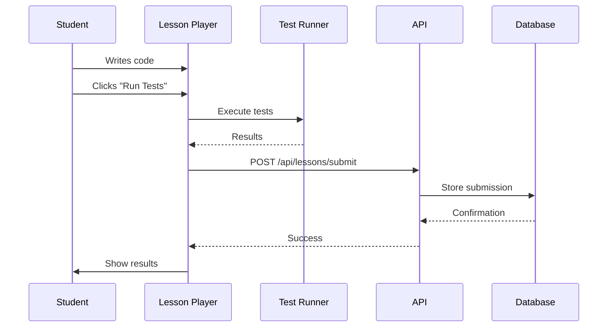

# Answer Submission Tracking - Quick Setup Guide

## 🚀 Quick Start

### Step 1: Run Database Migration

```bash
# Generate Prisma client with new LessonSubmission model
npx prisma generate

# Create and apply migration
npx prisma migrate dev --name add_lesson_submissions
```

### Step 2: Verify Setup

```bash
# Open Prisma Studio to see the new table
npx prisma studio
```

You should see the `LessonSubmission` table in the database.

### Step 3: Start Your Application

```bash
npm run dev
```

### Step 4: Access Admin Dashboard

Navigate to: [http://localhost:3000/admin/submissions](http://localhost:3000/admin/submissions)

---

## ✅ What Was Created

### 1. **Database Model**
File: `prisma/schema.prisma`

```prisma
model LessonSubmission {
  id          String   @id @default(uuid())
  userId      String
  lessonId    String   // e.g., "react-basics-01"
  stepId      String   // e.g., "react-basics-01-step-1"
  code        String   // Student's submitted code
  passed      Boolean  @default(false)
  testResults String?  // JSON of test results
  attempts    Int      @default(1)
  xpEarned    Int      @default(0)
  language    String   // typescript, jsx, tsx
  submittedAt DateTime @default(now())

  user        User     @relation(fields: [userId], references: [id])
}
```

### 2. **API Endpoints**

#### Submit Answer
- **POST** `/api/lessons/submit`
- **GET** `/api/lessons/submit?userId=xxx&lessonId=xxx&stepId=xxx`

#### Admin Access
- **GET** `/api/admin/submissions?lessonId=xxx&passed=true&limit=50`
- **POST** `/api/admin/submissions/stats` - Get statistics

### 3. **Admin Interface**
- **URL:** `/admin/submissions`
- **Features:**
  - View all submissions
  - Filter by lesson, user, status, language
  - Export to CSV
  - View detailed code and test results
  - Statistics dashboard

### 4. **Auto-Tracking**
Updated: `src/components/lessons/InteractiveLessonPlayer.tsx`
- Automatically submits code when "Run Tests" is clicked
- No action required from students

---

## 📊 How It Works



---

## 🎯 Example Usage

### Example 1: Student Submits Answer

When a student clicks "Run Tests" on react-basics-01:

```typescript
// Automatically sent to API
{
  userId: "user-123",
  lessonId: "react-basics-01",
  stepId: "react-basics-01-step-1",
  code: "function Greeting() { return <h1>Welcome to React!</h1>; }",
  passed: true,
  testResults: { ... },
  xpEarned: 50,
  language: "jsx"
}
```

### Example 2: View Student's Submission

Admin can see in dashboard:
- Student name and email
- Exact code submitted
- Whether it passed
- How many attempts
- Test results
- Submission timestamp

### Example 3: Analyze Lesson Difficulty

Visit stats endpoint to see:
- Pass rate: 85%
- Average attempts: 1.85
- Common mistakes in failed submissions

---

## 📁 File Locations

```
prisma/
├── schema.prisma                                    # ✅ LessonSubmission model

src/
├── app/
│   ├── api/
│   │   ├── lessons/
│   │   │   └── submit/
│   │   │       └── route.ts                        # ✅ Submit API
│   │   └── admin/
│   │       └── submissions/
│   │           └── route.ts                        # ✅ Admin API
│   └── admin/
│       └── submissions/
│           └── page.tsx                            # ✅ Admin UI
└── components/
    └── lessons/
        └── InteractiveLessonPlayer.tsx             # ✅ Auto-submit

docs/
└── ANSWER_SUBMISSION_TRACKING.md                   # ✅ Full documentation

ANSWER_TRACKING_SETUP.md                            # ✅ This file
```

---

## 🔍 Verify It's Working

### Test 1: Submit an Answer

1. Go to any interactive lesson (e.g., `/lessons/react-basics-01`)
2. Write some code
3. Click "Run Tests"
4. Check browser console - should see successful API call

### Test 2: View in Admin Panel

1. Go to `/admin/submissions`
2. You should see your submission in the list
3. Click on it to view full details

### Test 3: Check Database

```bash
# Open Prisma Studio
npx prisma studio

# Navigate to LessonSubmission table
# You should see your submission record
```

---

## 🎓 Usage Scenarios

### Scenario 1: Find Failed Submissions

```
1. Go to /admin/submissions
2. Set "Status" filter to "Failed"
3. Set "Lesson ID" to specific lesson
4. Click "Apply Filters"
5. Review failed attempts to identify issues
```

### Scenario 2: Track Student Progress

```
1. Go to /admin/submissions
2. Enter "User ID" in filter
3. View all submissions by that student
4. See progression through lessons
```

### Scenario 3: Export for Analysis

```
1. Apply desired filters
2. Click "Export CSV" button
3. Open in Excel/Google Sheets
4. Analyze data with pivot tables
```

---

## 🔧 Configuration

### Adjust User ID Source

Currently uses localStorage. To use actual auth:

```typescript
// In InteractiveLessonPlayer.tsx, line 78
// Change from:
const userId = localStorage.getItem('userId') || 'demo-user';

// To (example with auth store):
import { useAuthStore } from '@/stores/authStore';
const { user } = useAuthStore();
const userId = user?.id || 'anonymous';
```

### Adjust Submission Limits

In `src/app/api/admin/submissions/route.ts`:

```typescript
// Change default limit
const limit = parseInt(searchParams.get('limit') || '100'); // Changed from 50
```

---

## 📈 Statistics Available

The system automatically tracks:

| Metric | Description |
|--------|-------------|
| Total Submissions | All code submissions |
| Pass Rate | Percentage that passed tests |
| Unique Users | Number of different students |
| Avg Attempts | Average tries per lesson |
| By Language | Breakdown by TypeScript/JSX/etc |
| Timeline | Submissions over time |

---

## 🚦 Status Check

Run this checklist to verify everything works:

- [ ] Database migration completed
- [ ] Prisma client generated
- [ ] LessonSubmission table exists in database
- [ ] API endpoints respond (test with curl)
- [ ] Admin page loads without errors
- [ ] Lesson player submits answers automatically
- [ ] Submissions appear in admin dashboard
- [ ] Filters work correctly
- [ ] CSV export generates file
- [ ] Detailed view shows code and results

---

## 🆘 Troubleshooting

### Migration Fails

```bash
# Reset database (WARNING: deletes all data)
npx prisma migrate reset

# Then retry
npx prisma migrate dev --name add_lesson_submissions
```

### Admin Page Shows Error

```bash
# Regenerate Prisma client
npx prisma generate

# Restart dev server
npm run dev
```

### Submissions Not Saving

Check:
1. API endpoint accessible: `curl http://localhost:3000/api/lessons/submit`
2. User exists in database
3. Browser console for errors

---

## 📚 Documentation

**Full Documentation:** [docs/ANSWER_SUBMISSION_TRACKING.md](./docs/ANSWER_SUBMISSION_TRACKING.md)

**Includes:**
- Complete API reference
- Advanced queries
- Security considerations
- Future enhancements
- Detailed examples

---

## ✨ Quick Tips

1. **Filter by Lesson** to find all submissions for a specific lesson
2. **Filter by Failed** to identify common mistakes
3. **Export to CSV** for detailed analysis in spreadsheets
4. **Check Attempts** to see if lessons are too difficult
5. **View Code** to verify students used correct solutions

---

## 🎉 You're Done!

The answer submission tracking system is now active. Every time a student clicks "Run Tests", their code is automatically saved and you can review it in the admin dashboard.

**Next Steps:**
1. Test with a few lessons
2. Review submissions in admin panel
3. Use data to improve lessons
4. Share insights with team

---

**Status:** ✅ Ready for Use
**Access:** `/admin/submissions`
**Documentation:** `docs/ANSWER_SUBMISSION_TRACKING.md`

---

*Setup completed: 2025-10-29*
*Version: 1.0*
