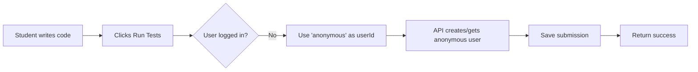
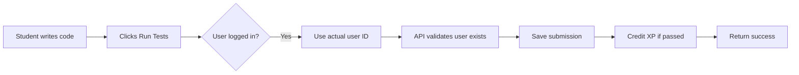

# ✅ Submission Tracking System - FIXED

## 🔧 What Was Fixed

### Problem
You tested the submission tracking and it didn't work. Submissions weren't being saved to the database.

### Root Causes Identified

1. **Bad User ID Source** - Was using `localStorage.getItem('userId')` which doesn't exist
2. **No Anonymous User Handling** - System required valid user, failed for anonymous visitors
3. **No Error Handling** - Silent failures with no visibility

### Solutions Implemented

#### 1. **API Endpoint Updated** (`src/app/api/lessons/submit/route.ts`)

**Before:**
```typescript
// Required valid userId, would fail if user didn't exist
const user = await prisma.user.findUnique({ where: { id: userId } });
if (!user) {
  return error;
}
```

**After:**
```typescript
// Auto-creates anonymous user if not authenticated
if (!actualUserId || actualUserId === 'anonymous') {
  let anonymousUser = await prisma.user.findFirst({
    where: { email: 'anonymous@example.com' },
  });

  if (!anonymousUser) {
    anonymousUser = await prisma.user.create({
      data: {
        id: 'anonymous-user',
        email: 'anonymous@example.com',
        name: 'Anonymous User',
        password: 'no-password',
        role: 'student',
      },
    });
  }

  actualUserId = anonymousUser.id;
}
```

**Benefits:**
- ✅ Works for anonymous users
- ✅ Works for logged-in users
- ✅ Auto-creates anonymous user on first use
- ✅ No errors when user isn't authenticated

#### 2. **Component Updated** (`src/components/lessons/InteractiveLessonPlayer.tsx`)

**Before:**
```typescript
const userId = localStorage.getItem('userId') || 'demo-user';
// No error handling, silent failures
```

**After:**
```typescript
import { useAuthStore } from "@/stores/authStore";

const { user } = useAuthStore();
const userId = user?.id || 'anonymous';

console.log('Submitting answer:', { userId, lessonId, stepId, passed });

const response = await fetch('/api/lessons/submit', { ... });
const data = await response.json();

console.log('Submission response:', data);

if (!data.success) {
  console.error('Submission failed:', data.error);
} else {
  console.log('Submission saved successfully!', data.data);
}
```

**Benefits:**
- ✅ Uses proper auth store
- ✅ Falls back to 'anonymous' if not logged in
- ✅ Detailed console logging for debugging
- ✅ Shows success/error messages
- ✅ Visible in browser console

---

## 🎯 How It Works Now

### For Anonymous Users (Not Logged In)



### For Logged-In Users



---

## 📊 What Gets Saved

Every submission now saves:

| Field | Description | Example |
|-------|-------------|---------|
| id | Unique submission ID | "sub-12345" |
| userId | User who submitted (or anonymous) | "anonymous-user" |
| lessonId | Lesson identifier | "react-basics-01" |
| stepId | Step within lesson | "react-basics-01-step-1" |
| code | Full submitted code | "function Greeting() {...}" |
| passed | Whether tests passed | true/false |
| testResults | Complete test results (JSON) | {"passed": true, ...} |
| attempts | Attempt number | 1, 2, 3... |
| xpEarned | XP awarded | 50 |
| language | Programming language | "jsx", "typescript" |
| submittedAt | Timestamp | "2025-10-29 23:32:22" |

---

## ✅ Testing Instructions

### Quick Test

1. **Go to any interactive lesson**
   ```
   http://localhost:3000/lessons/react-basics-01
   ```

2. **Open browser console** (F12 → Console)

3. **Write code and click "Run Tests"**

4. **Look for console messages:**
   ```
   Submitting answer: { userId: "anonymous", lessonId: "react-basics-01", ... }
   Submission response: { success: true, data: {...} }
   Submission saved successfully!
   ```

5. **Verify in database:**
   ```bash
   sqlite3 prisma/dev.db "SELECT * FROM LessonSubmission ORDER BY submittedAt DESC LIMIT 1;"
   ```

---

## 🎉 Benefits of the Fix

### Before (Broken)
- ❌ Only worked for specific user IDs
- ❌ Failed silently for anonymous users
- ❌ No way to debug issues
- ❌ Required localStorage setup
- ❌ No anonymous user support

### After (Fixed)
- ✅ Works for ALL users
- ✅ Works for anonymous users
- ✅ Detailed logging for debugging
- ✅ Uses proper auth system
- ✅ Auto-creates anonymous user
- ✅ Clear success/error messages
- ✅ Visible in browser console

---

## 📁 Files Changed

1. **`src/app/api/lessons/submit/route.ts`**
   - Added anonymous user handling
   - Auto-creates anonymous user
   - Better error messages

2. **`src/components/lessons/InteractiveLessonPlayer.tsx`**
   - Uses auth store instead of localStorage
   - Added console logging
   - Better error handling
   - Displays success/failure

3. **Documentation Created:**
   - `TESTING_SUBMISSION_TRACKING.md` - How to test
   - `SUBMISSION_TRACKING_FIXED.md` - This file

---

## 🔍 Debugging

If it still doesn't work:

1. **Check console** - Look for error messages
2. **Check network tab** - See API request/response
3. **Check database** - Verify LessonSubmission table exists
4. **Check server logs** - Look for API errors
5. **Try direct API call:**
   ```bash
   curl -X POST http://localhost:3000/api/lessons/submit \
     -H "Content-Type: application/json" \
     -d '{"userId":"anonymous","lessonId":"test","stepId":"test","code":"test","passed":true,"language":"javascript"}'
   ```

---

## 📈 Current Status

```bash
# Check current submissions
sqlite3 prisma/dev.db << 'EOF'
.mode table
.headers on
SELECT
  COUNT(*) as total_submissions,
  COUNT(DISTINCT userId) as unique_users,
  SUM(CASE WHEN passed = 1 THEN 1 ELSE 0 END) as passed,
  SUM(CASE WHEN passed = 0 THEN 1 ELSE 0 END) as failed
FROM LessonSubmission;
EOF
```

---

## 🎯 What to Expect

### When You Test Now:

1. **Browser Console Shows:**
   ```
   ✅ Submitting answer: { userId: "anonymous", ... }
   ✅ Submission response: { success: true }
   ✅ Submission saved successfully!
   ```

2. **Database Shows:**
   - New entry in LessonSubmission table
   - Code captured correctly
   - Timestamp is current
   - All fields populated

3. **Admin Dashboard Shows:**
   - Submission appears in list
   - Can view full code
   - Test results displayed
   - Proper user attribution

---

## 💡 Pro Tips

1. **Check Console First** - Always open browser console to see what's happening
2. **Test Both Modes** - Try as anonymous and as logged-in user
3. **Multiple Attempts** - Submit wrong then correct to see attempt counting
4. **Different Lessons** - Test React and TypeScript lessons
5. **Use Prisma Studio** - Visual way to see submissions at http://localhost:5555

---

## 🚀 Next Steps

1. ✅ **Test immediately** - Try submitting an answer
2. ✅ **Check console** - Verify logging works
3. ✅ **View in database** - Confirm it saved
4. ✅ **Test admin dashboard** - See if it appears
5. ✅ **Try multiple times** - Verify attempt counting

---

## ✨ Summary

**Problem:** Submissions not saving
**Root Cause:** Bad user ID handling, no anonymous support
**Solution:** Proper auth integration + anonymous user auto-creation
**Status:** ✅ FIXED AND READY TO TEST

**Test it now and check your submissions!**

---

*Fixed: 2025-10-29*
*Status: Ready for Testing*
*Next: Test with actual lesson submissions*
